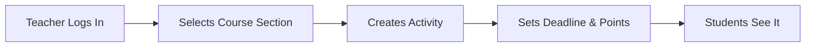
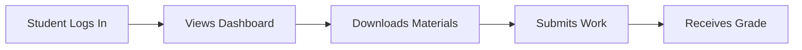

# HNA Acadex Backend

<p align="center">
  
  
  
  
  
</p>

> A comprehensive school management system backend for Highland Nest Academy. Handles courses, assignments, quizzes, grades, attendance, and communication.

---

## Table of Contents

- [Overview](#overview)
- [Why Django?](#why-django)
- [Key Components](#key-components)
- [API Endpoints](#api-endpoints)
- [Data Models](#data-models)
- [How It Works](#how-it-works)
- [Tech Stack](#tech-stack)
- [Project Structure](#project-structure)
- [Security](#security)
- [Future Plans](#future-plans)

---

## Overview

HNA Acadex is a web-based school management system designed for **Highland Nest Academy**. It provides a complete digital ecosystem for managing student learning with features for:

- Course and section management
- Assignment and quiz creation
- Online submission and grading
- Automated grade calculation
- Attendance tracking
- Real-time notifications
- Push notification support

---

## Why Django?

| Reason           | Description                                                      |
| ---------------- | ---------------------------------------------------------------- |
| **Security**     | Built-in protection against SQL injection, XSS, and CSRF attacks |
| **Speed**        | Ready-made components for auth, admin, and database operations   |
| **Scale**        | Powers Instagram, Pinterest, and other high-traffic apps         |
| **Ecosystem**    | Django REST Framework + vast library of extensions               |
| **Architecture** | Clean separation of models, views, and URLs                      |

---

## Key Components

### User Roles

| Role                                                                | Capabilities                                                      |
| ------------------------------------------------------------------- | ----------------------------------------------------------------- |
|    | Manage system settings, reset passwords, full oversight           |
|  | Create courses, post assignments, grade students, take attendance |
|  | View courses, submit work, take quizzes, check grades             |

### User Attributes

- **Email** - Login identifier
- **Full Name** - Display name
- **Grade Level** - Grade 7-12
- **Strand** - STEM, ABM, HUMSS, TVL, GAS
- **Section** - Class section (e.g., "Section - Emerald")
- **Avatar** - Profile picture

### Course Hierarchy

```
Course (e.g., "Mathematics")
    │
    └── Course Section (e.g., "Math - Grade 10 - Section Emerald - SY 2025-2026")
              │
              ├── Weekly Modules
              │     └── Activities (Assignments/Quizzes)
              │
              ├── Students (Enrollments)
              └── Teacher (Assigned)
```

### Grade Calculation

Teachers define **Assignment Groups** with percentage weights:

```
Quarterly Exams    ████████░░  40%
Seatworks          █████░░░░░  25%
Projects           ██████░░░░  20%
Recitations        ███░░░░░░░  15%
```

The system automatically computes final grades.

### Attendance States

| Status  | Icon | Description            |
| ------- | ---- | ---------------------- |
| Present | ✅   | Attended class         |
| Absent  | ❌   | Did not attend         |
| Late    | ⏰   | Arrived late           |
| Excused | 📝   | Absent with permission |

---

## API Endpoints

### Authentication

```
POST   /auth/login/           # Login (returns JWT token)
POST   /auth/refresh/         # Refresh expired token
POST   /auth/change-password/ # Change password
POST   /auth/forgot-password/ # Request password reset
GET    /auth/me/              # Get current user info
```

### Courses

```
GET    /courses/student/                    # Student's enrolled courses
GET    /courses/teacher/                     # Teacher's assigned courses
GET    /course-sections/{id}/content/        # Course materials & assignments
GET    /course-sections/{id}/gradebook/      # All student grades
GET    /course-sections/{id}/grades/         # Course grades summary
```

### Assignments & Submissions

```
POST   /activities/{id}/submit/              # Submit assignment
GET    /activities/{id}/my-submission/       # View my submission
GET    /activities/{id}/submissions/         # Teacher: all submissions
POST   /activity-submissions/{id}/grade/     # Teacher: grade submission
```

### Quizzes

```
GET    /quizzes/{id}/take/                   # Start/continue quiz
POST   /quizzes/{id}/submit-attempt/         # Submit quiz answers
GET    /quizzes/{id}/my-latest-attempt/      # View my results
POST   /quiz-answers/{id}/grade/              # Teacher: grade essay
POST   /quizzes/quick-create/                 # Create quiz quickly
```

### Attendance

```
GET    /course-sections/{id}/attendance/    # Attendance overview
POST   /course-sections/{id}/attendance/sessions/     # Create session
DELETE /attendance/sessions/{id}/             # Delete session
PATCH  /attendance/sessions/{id}/records/    # Bulk update records
```

### Communication & Tasks

```
GET    /notifications/                        # My notifications
GET    /announcements/                       # Course/school announcements
GET    /calendar-events/                     # Calendar events
GET    /todo-items/                          # My to-do list
```

---

## Data Models

| Model                | Description                                 |
| -------------------- | ------------------------------------------- |
| **User**             | Students, teachers, and admins              |
| **Section**          | Class sections (Grade 10 - Section Emerald) |
| **Course**           | Subject definitions (Math 10, English 10)   |
| **CourseSection**    | Course instance taught to a section         |
| **Enrollment**       | Student enrollment in a course section      |
| **WeeklyModule**     | Weekly lesson topics                        |
| **AssignmentGroup**  | Assignment categories with weights          |
| **Activity**         | Assignments and homework                    |
| **CourseFile**       | Learning materials (PDFs, docs)             |
| **Quiz**             | Quiz/exam definitions                       |
| **QuizQuestion**     | Questions within a quiz                     |
| **QuizChoice**       | Multiple choice options                     |
| **QuizAttempt**      | Student's quiz attempt                      |
| **QuizAnswer**       | Student's answer to a question              |
| **Submission**       | Student's assignment submission             |
| **MeetingSession**   | A class session (date, topic)               |
| **AttendanceRecord** | Student's attendance status                 |
| **Announcement**     | Teacher/school announcements                |
| **CalendarEvent**    | Deadlines, events, exams                    |
| **TodoItem**         | Personal task list                          |
| **Notification**     | In-app notification records                 |
| **PushToken**        | Device tokens for push notifications        |
| **ActivityReminder** | Scheduled assignment reminders              |

---

## How It Works

### Teacher Creates Assignment



### Student Submits Work



### Quiz Flow

```
┌─────────────┐    ┌─────────────┐    ┌─────────────┐    ┌─────────────┐
│   Open Quiz │───▶│  Answer     │───▶│  Submit     │───▶│  View Score │
│             │    │  Questions │    │  Answers    │    │             │
└─────────────┘    └─────────────┘    └─────────────┘    └─────────────┘
                         │                   │
                         ▼                   ▼
                   Auto-Grade           Teacher Grades
                   Multiple Choice      Essay Questions
```

### Attendance Tracking

```
Teacher's View:
┌─────────────────────────────────────────────────────┐
│  Meeting Session: March 16, 2026 - Math 10          │
├──────────────┬────────────┬──────────────────────────┤
│ Student      │ Status    │ Remarks                  │
├──────────────┼────────────┼──────────────────────────┤
│ John Doe     │ ✅ Present│                          │
│ Jane Smith   │ ⏰ Late   │ Arrived 10 mins late     │
│ Bob Wilson   │ ❌ Absent │                          │
│ Alice Brown  │ 📝 Excused│ Doctor's note           │
└──────────────┴────────────┴──────────────────────────┘
```

---

## Tech Stack

### Core


### Database & Cache


### Authentication & Security


### Background Tasks


### External Services


---

## Project Structure

```
hna-acadex-backend/
│
├── config/                      # Django project config
│   ├── settings.py              # Main settings
│   ├── urls.py                  # URL routing
│   ├── asgi.py                  # ASGI config
│   └── wsgi.py                  # WSGI config
│
├── core/                        # Main application
│   ├── models.py                # Database models (20+ models)
│   ├── views.py                 # API views/endpoints
│   ├── serializers.py           # DRF serializers
│   ├── permissions.py           # Custom permissions
│   ├── urls.py                  # API routes
│   ├── admin.py                 # Django admin config
│   ├── signals.py               # Django signals
│   ├── tasks.py                 # Celery tasks
│   ├── email_utils.py           # Email utilities
│   └── push_notifications.py    # FCM integration
│
├── .env.example                 # Environment template
├── manage.py                    # Django management script
├── requirements.txt             # Python dependencies
└── render.yaml                  # Render.com deployment config
```

---

## Security

| Feature              | Implementation             |
| -------------------- | -------------------------- |
| **Password Hashing** | PBKDF2 (Django default)    |
| **Token Auth**       | JWT with expiration        |
| **CORS**             | Configured allowed origins |
| **HTTPS**            | Enforced in production     |
| **Access Control**   | Role-based permissions     |
| **CSRF Protection**  | Enabled by default         |

---

<p align="center">
  <sub>Built with ❤️ for Holy Name Academy</sub>
</p>
